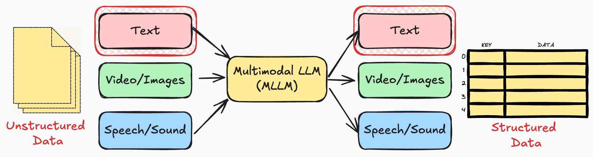

# Process Data

:::{admonition}

:::


## Chat Interface
:::{admonition}

[ChatGPT](https://chatgpt.com/)
:::

:::{tip}
#### Chat mode is useful for trying stuff out and exploring the data
:::

```{admonition} Demo
:class: dropdown
Let's look at some interview data in a chat interface
```

## Application Development Workflow

:::{admonition}

:::

:::{important}

:::

:::{tip}
#### APIs are for processing data at scale. For large collections of data, it's even better to use a *bulk API*.
:::

```{admonition} Demo
:class: dropdown
Let's look at some interview data in a notebook
```