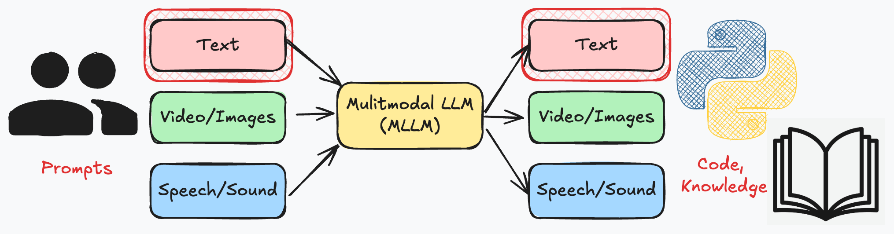
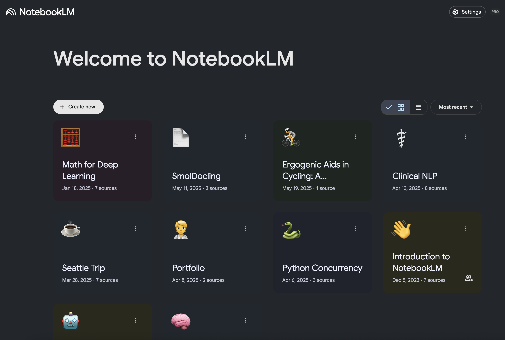

# Support Tools

:::{admonition}

:::

## Knowledge Support

:::{admonition}

[Google Notebook LM](https://notebooklm.google/)
:::

```{admonition} Demo
:class: dropdown
Ask NotebookLM to summarize a research paper
```

## Code Generation

:::{admonition}

[Source: Revenge of the Junior Developer](https://sourcegraph.com/blog/revenge-of-the-junior-developer)
:::


:::{admonition}

[Copilot for VSCode](https://code.visualstudio.com/docs/copilot/overview)
:::

```{admonition} Demo
:class: dropdown
Use GitHub Copilot to generate code for a research project
```